# Goldscrolls

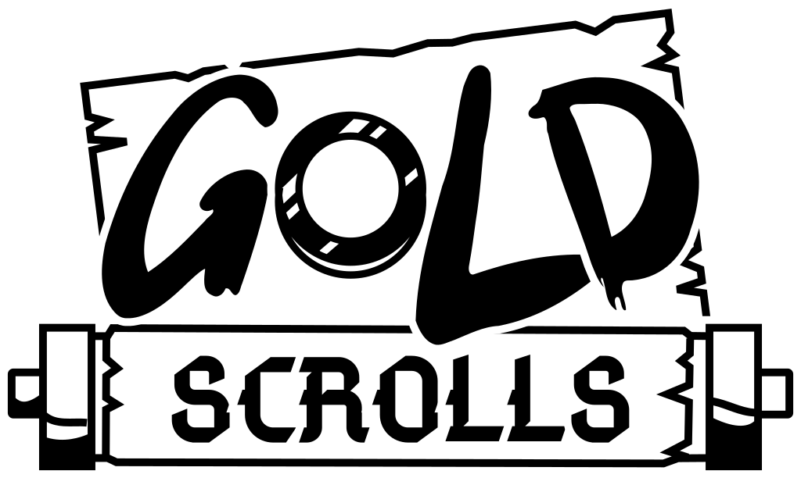

A fast Print-and-Play Roll-and-Write Deckbuilder for two players. Choose your alchemist, craft, and use scrolls to fight your opponent and win the Goldscrolls tournament!

---

<a href="https://www.kesiev.com/goldscrolls">Homepage</a>

---

The Goldscrolls tournament is the most anticipated event of the year and hosts all the alchemists around the Empire to crown the best of the best.

To fight in the Goldscrolls tournament you and your friends must select an alchemist to play and print his character sheet. You can download the character sheets PDF here.

### Aphla

**School:** Wanderers

When she was only a child, Aphla was found crying in an empty barrel by an alchemist from the Wanderers school, who raised her as the school tradition imposed. Following the very same tradition, her adoptive father had to abandon her in the crowd of the Capital market at the age of 15. It took years for her to forget her anger at being abandoned twice... until she found out that her father would be participating in the Goldscrolls tournament. Which one she will face?

  * [Download the Aphla character sheet PDF v0.1](pdfs/aphla-v0.1.pdf)

### Tabe

**School:** Merchants

Abe and Bea are the most skilled Merchants in the Empire, but what has made them famous is their unbreakable love. Their life is a constant honeymoon and work trip, from which they stopped only once to give birth to little Tabe. Periodically they send her 'love in writing' and lots of Gold, so that she can grow up healthy and strong to find the love of her life. Tabe, once eighteen, has instead decided to invest her parents' money in another way: create the largest spy network in the Empire to track and punish them in an exemplary way. While it's almost impossible to know where in the Empire they are, there is a day and a place they always show up: the day of the Goldscroll tournament held annually in the Capital.

  * [Download the Tabe character sheet PDF v0.1](pdfs/tabe-v0.1.pdf)

### Magma

**School:** Miners

At birth, the Miners of the mountain range of the Edge of the World are destined to do one specific work and learn the alchemical arts they serve. Magma had never been able to accept it: how is it possible to know alchemy only by studying few powers? His father tried to explain to him that alchemical powers are just tools but that day he slammed the door in his face and run away from home. If his father had studied all the alchemical arts he could have saved his mother from the landslide. Magma will not make the same mistake: he will become strong to defend those he loves.

  * [Download the Magma character sheet PDF v0.1](pdfs/magma-v0.1.pdf)

# Game manual

## Materials

Every player needs:

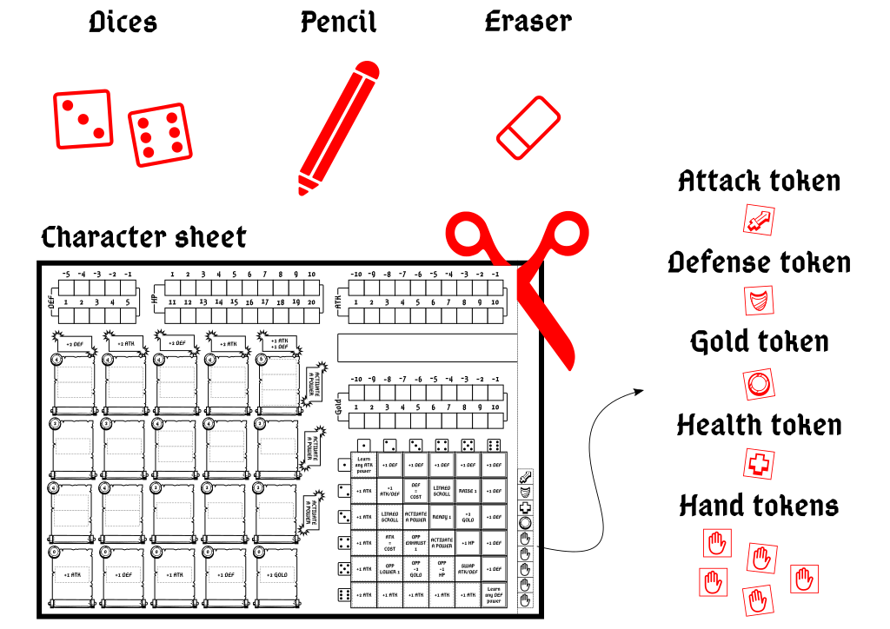

  * A character sheet
  * 5 Hand tokens, a Gold token, a Health token, a Defense token, and an Attack token (you can cut these tokens from the right side of any character sheet)
  * A pencil
  * An eraser
  * 2 six-sided dices (players may share the same pair of dices while playing)

## The character sheet

The players will join the Goldscrolls tournament and fight as an alchemist. Every player will choose a character and use his sheet to track health, gold, scrolls, and more.

This is a quick overview of the character sheet sections:

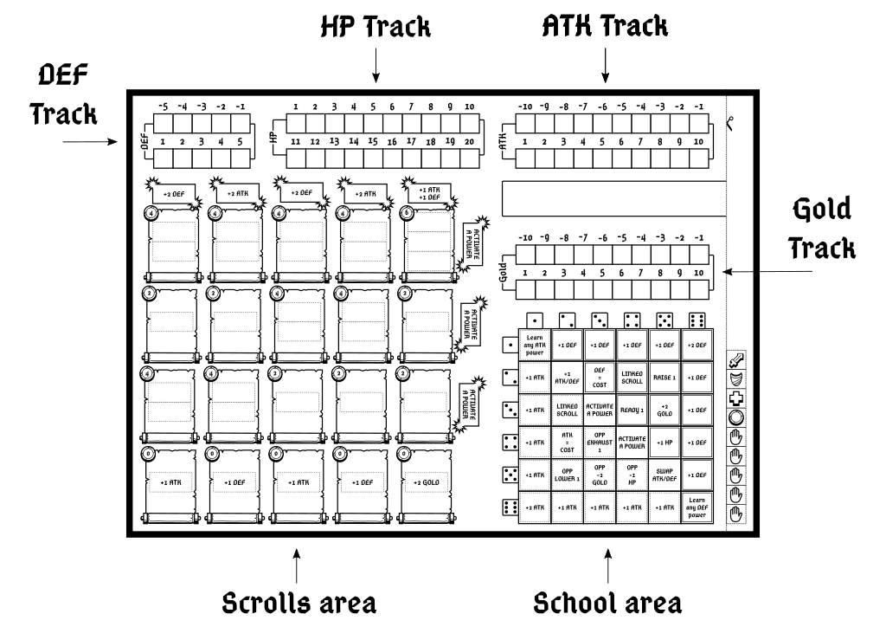

### DEF track

Tracks the player's Defense value using the Defense token. It tracks both positive (Defense) and negative (Defense malus) values. When the Defense token is missing from this track, the player's Defense value is 0. The Defense token can't move over the Defense track minimum or maximum value, limiting the player's Defense value.

### HP track

Tracks the player Health value using the Health token. When the Health token is missing from this track, the player Health value is 0 and his opponent wins at the end of his turn. The Health token can't move over the Health track maximum value and below 0, limiting the player Health maximum value.

### Gold track

Tracks the Gold available to the player during his turn value using the Gold token. It tracks both positive (available Gold) and negative (Gold malus) values. When the Gold token is missing from this track, the player has no Gold. The Gold token can't move over the Gold track minimum or maximum value, limiting the Gold the player can use during his turn.

### ATK track

Tracks the player's Attack value during his turn value using the Attack token. It tracks both positive (Attack) and negative (Attack malus) values. When the Attack token is missing from this track, the player Attack value is 0 and can't attack. The Attack token can't move over the Attack track minimum or maximum value, limiting the damage the player can deal attacking in his turn.

### Scrolls area

The scrolls the player can use during the battle. Every scroll has its own cost in Gold printed into its coin icon and several boxes with powers printed in that can be activated during the player's turn. The scrolls with empty dashed boxes can be purchased, filled in with new powers, and used in battle.

All of the scroll columns and the first 3 scroll rows have a box that contains a Slash power that's activated when all of the scrolls of that row or column are purchased.

### School area

Every character belongs to a specific school, which has its own rules to teach powers to alchemists, so this area may differ from character to character. Read the Schools and Learning section of this manual for more.

## Preparation

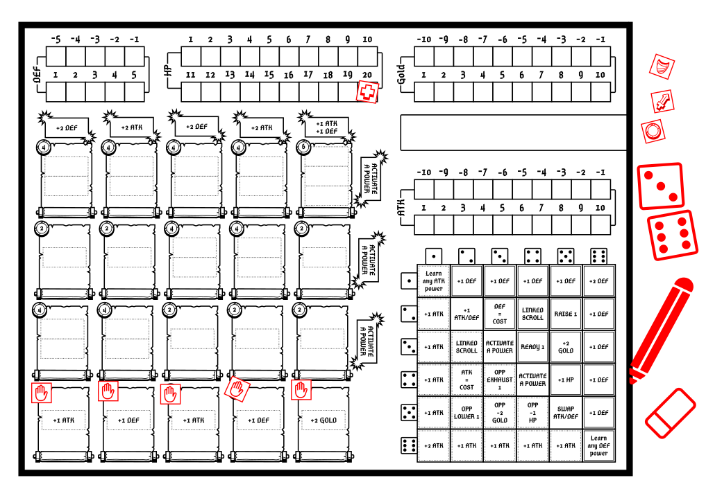

All players:

  - Erase all of the pencil notes and marks from the character sheet
  - Keep all of the other tokens, the pencil, the dices, and the eraser on a side of the character sheet
  - Place the health token on the maximum value of the HP track of the character sheet
  - Place one Hand token over each coin symbol of the 5 scrolls at the bottom of the character sheet

Then:

  - Randomly decide the first player
  - Start the first turn

## Turn actions

At the start of your turn check your Defense value: if it's less equal to 0 you're undefended. Keep this in mind since it may affect some power effects.

Then you must perform any of the following actions multiple times and in any order:

### Activate a ready scroll

The scrolls with a Hand token on their coin symbol are ready and they can be activated. You can choose one of your ready scrolls and activate it.

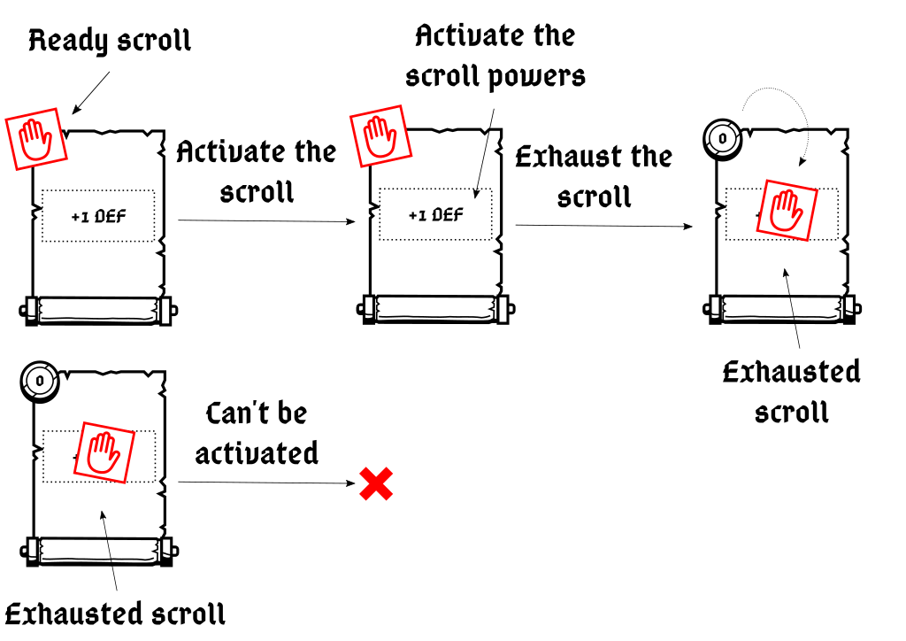

When a scroll is activated all of the powers written on it must be activated one by one, following the scroll order. Powers having a name starting with OPP or OPPONENT are targeting your opponent, so he has to apply its effects. In any other case, the power always targets yourself so you've to apply its effects. Powers may help you and obstruct your opponent - have a look at the Powers sections of this manual for a complete description.

When all of the scroll powers are activated move the Hand token from its coin symbol to its center: this scroll is now exhausted and cannot be activated until it becomes ready again.

You don't have to activate all of your ready scrolls in your turn: the scrolls you won't activate will be kept ready for the next turn.

#### Alchemy of +x ATK power

Alchemists can convert a +x ATK power targeting themselves into a +x GOLD power. To do that, increase the available Gold by x instead of increasing the Attack value.

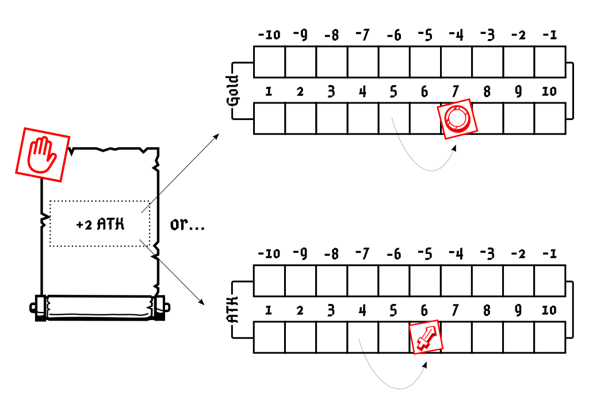

#### Alchemy of +x DEF power

A +x DEF power increases the target Defense value. When its effect is targeting yourself it increases your Defense value only if you're undefended. If you're not undefended a +x DEF targeting yourself must be turned into Gold.

A +x DEF power targeting yourself may be used as a +x GOLD power instead, as you do for the +x ATK power.

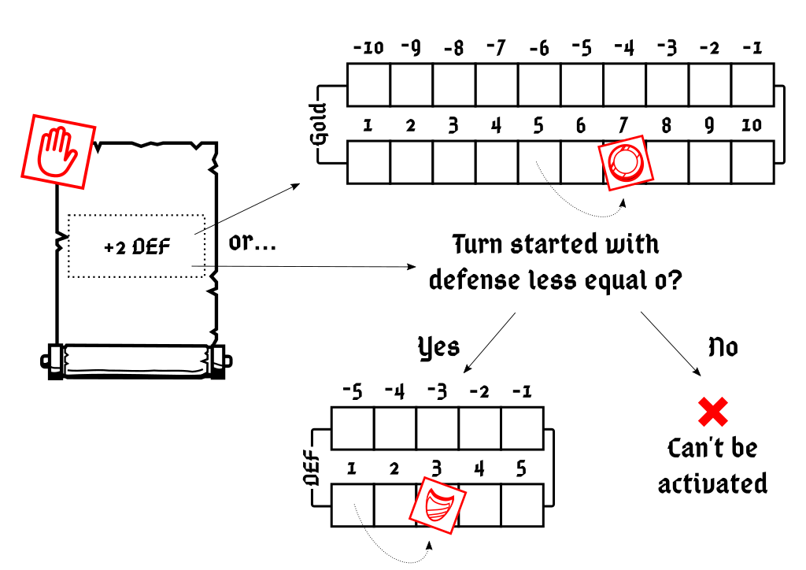

### Purchase a scroll

Any scroll in your Scrolls area with an empty space that is over another scroll with no empty spaces is purchasable. During your turn, you may purchase them with Gold to get stronger.

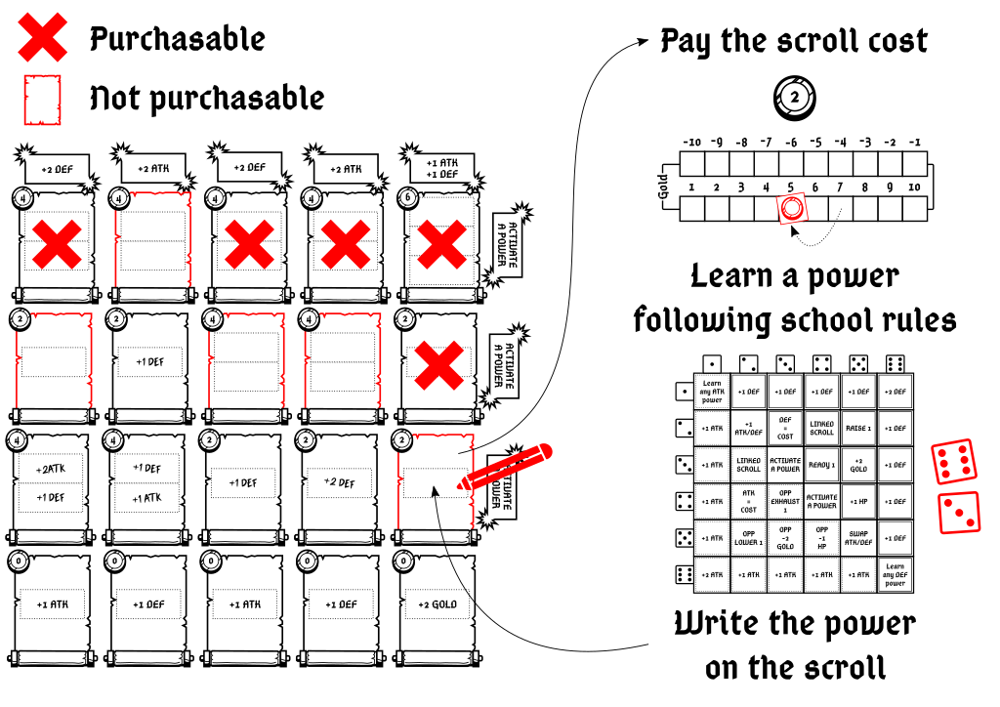

The scroll cost is printed into the coin icon over that scroll. To buy a scroll decrease the Gold track by its cost and fill in all of its empty spaces one by one with the powers following your character school learning method. You'll find more about the learning method in the Schools and Learning section of this manual.

You must have enough gold to buy a scroll otherwise that scroll can't be bought.

#### Slash power

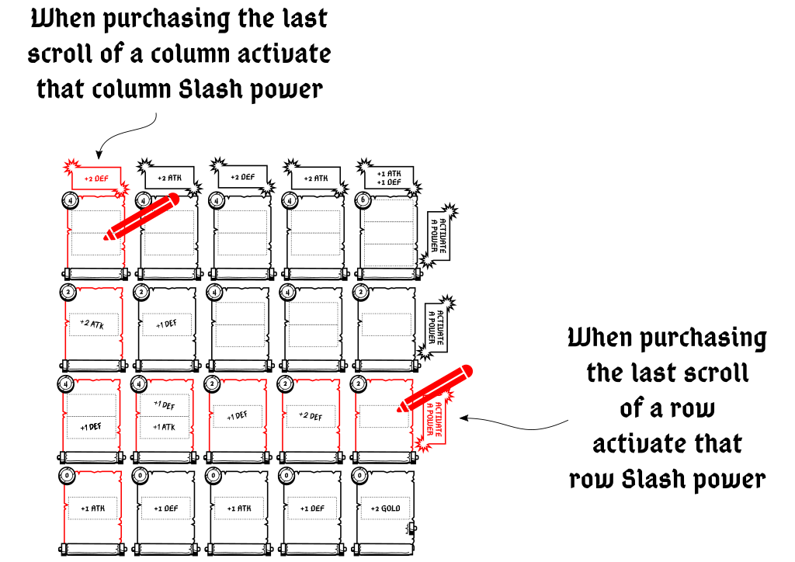

After purchasing a scroll check all of the scrolls on the same column: if all of them are available (i.e. they don't have any empty space) you must activate the power written in the box at the head of that column immediately. Once that power is activated, its power won't be activated again for the rest of the match.

The same goes for the rows: if all of the scrolls on the same row of the one you purchased are available you may activate the power written in the box at the right of that row immediately. That power won't be activated again for the rest of the match.

### Attack your opponent

If your Attack value is greater than 0, you may attack your opponent.

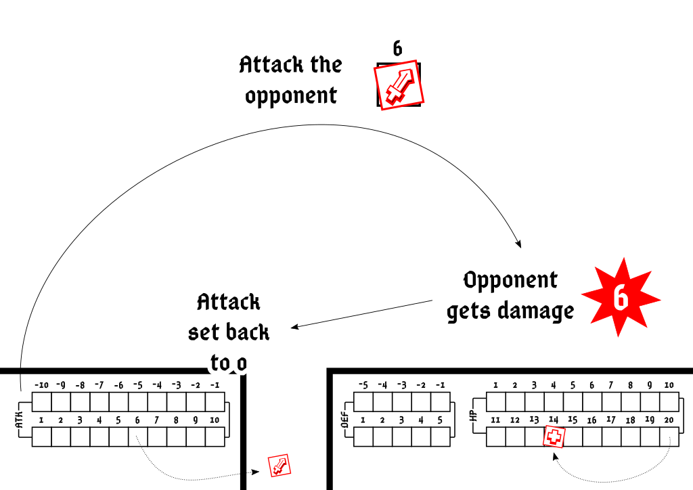

Inflict the opponent as damage as your Attack value, which will manage it as described in the Defending section of this manual. After the attack ends, set your Attack value back to 0 removing the Attack token from your character sheet.

### Break your defense

If your Attack value is greater equal than your Defense value, you may break your defense.

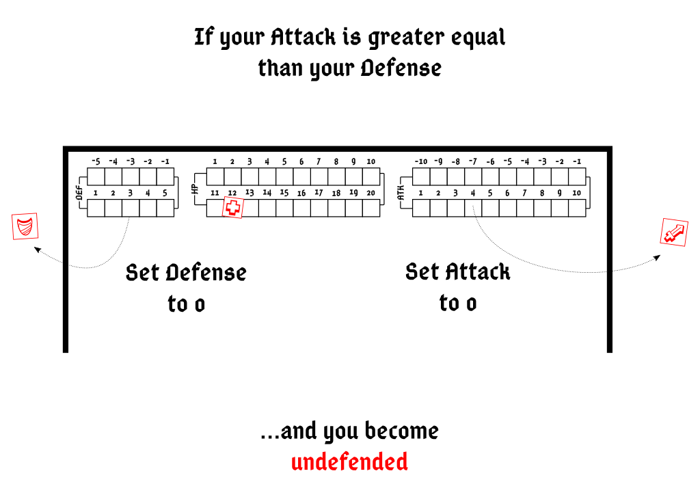

Set both your Defense and Attack value to 0 removing the Defense token and the Attack token from your sheet. You're undefended for the rest of your turn.

### Pass

When you decide to pass, your turn ends.

## Turn end

When your turn ends:

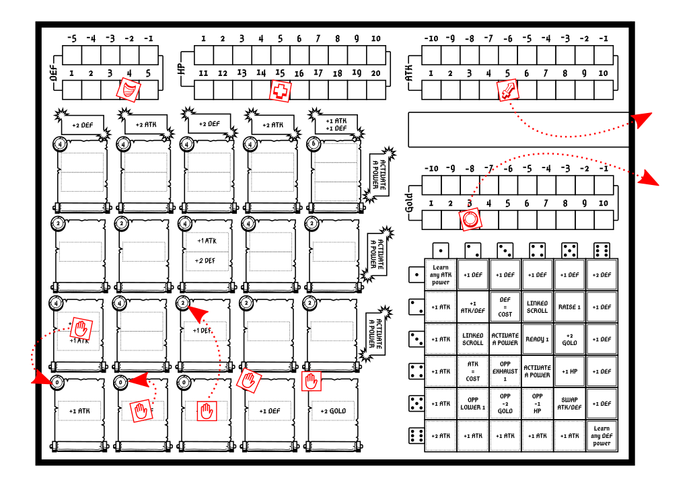

  - If your opponent has no health, you won! If your opponent is still alive...
  - Set your Attack and Gold values back to 0 removing the Attack and Gold tokens from your board. Your Defense value is not changed.
  - Raise all of your exhausted scrolls. To do that find all the scrolls on your character sheet Scrolls area with a Hand token on its center (i.e. the exhausted scrolls) and keep moving its Hand token up over the next scroll of the same column until you meet one with no empty spaces. If you reached the top of that column and can't move the Hand token any further, move the Hand token back to the scroll at the bottom of the same column. It may happen that rising a scroll the Hand token ends in the same scroll it started.
  - Ready all of your scrolls. To do that move all of your Hand tokens that are on the center of a scroll to that scroll coin symbol.
  - Start your opponent's turn.

## Defending

When your opponent inflicts damage to you:

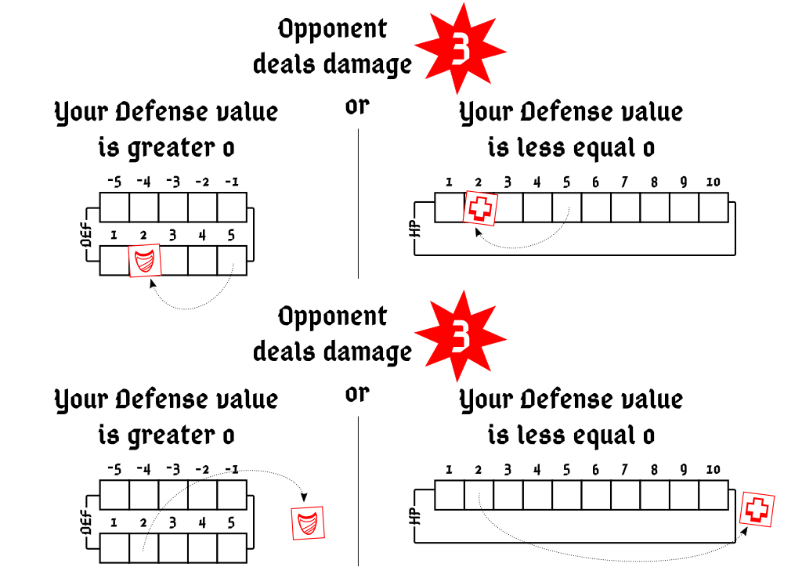

  - If your defense value is greater than 0, you must decrease the Defense value by the inflicted damage. Your Defense value can't go under 0 this way so, when it hits 0, your defense ends and any remaining damage is lost.
  - If your defense value is 0 or less, you must decrease your Health value by the inflicted damage. If you hit the 0, your opponent wins at the end of his turn!

## Schools and Learning

An alchemist has to follow a particular procedure to access the mighty powers of alchemy. This procedure is called Learning and is handed down to all the young alchemists by one of the Empire authorized alchemy schools.

The alchemists are introduced using their school name as a title at any official event of the Empire, like the Goldscrolls tournament. So Aphla the Wanderer comes from the Wanderers school, Tabe the Merchant comes from the Merchants school, and so on.

The characters you're going to play will use his school learning procedure to inscribe powers in scrolls and unleash them in battle. You're going to use what's in your character sheet School area and follow your character school learning procedures described in this section.

### Merchants

The Merchants have in their ranks the richest people of the Empire. Their members don't share their knowledge for free: rookies have to pay good money to veterans for their private lessons. The Merchants' motto is 'Gold for Power, Power for Gold' and, considering that their business extends far beyond the walls of the Empire, it is no wonder that their guild is among the most feared and respected.

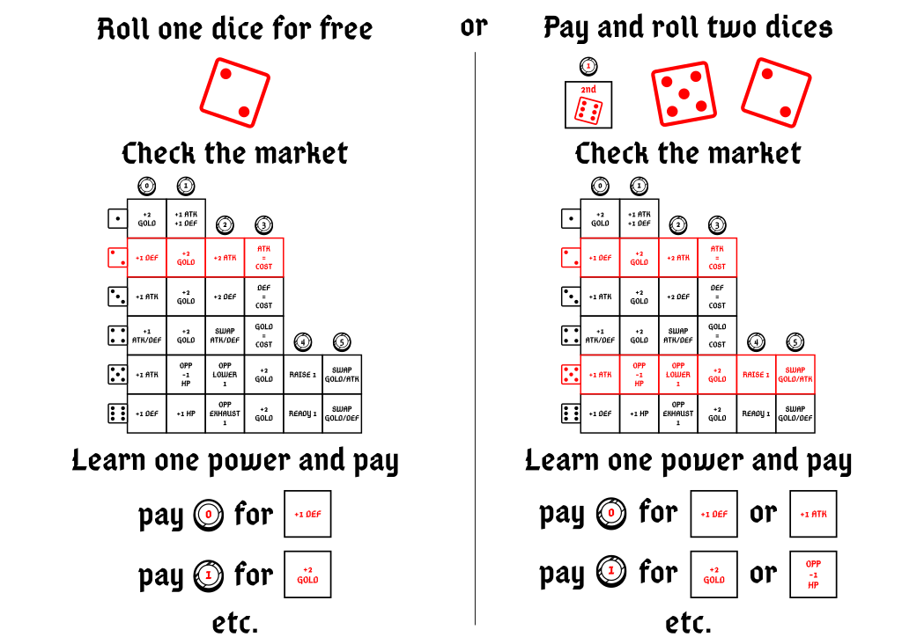

_School learning procedure: Pick a dice. You may pay the price of the second dice to pick it too. Roll the dices you picked and choose any power on the rows matching the rolled dices values, paying the price in Gold reported in the coin icon at top of the matching column. You've to pay the power full price to buy it._

### Miners

The Miners use the alchemy power to extract minerals from the mountain range of the Edge of the World at the northern side of the Empire. They work in small teams of specialists, so Miner alchemists tend to spend a lot of time and gold to specialize on specific tasks to form a group. An ancient Merchant proverb says 'There is the right miner for every gem' and so is combat: if you have the misfortune to meet the Miner that matches your way of fighting you'll have a bad time.

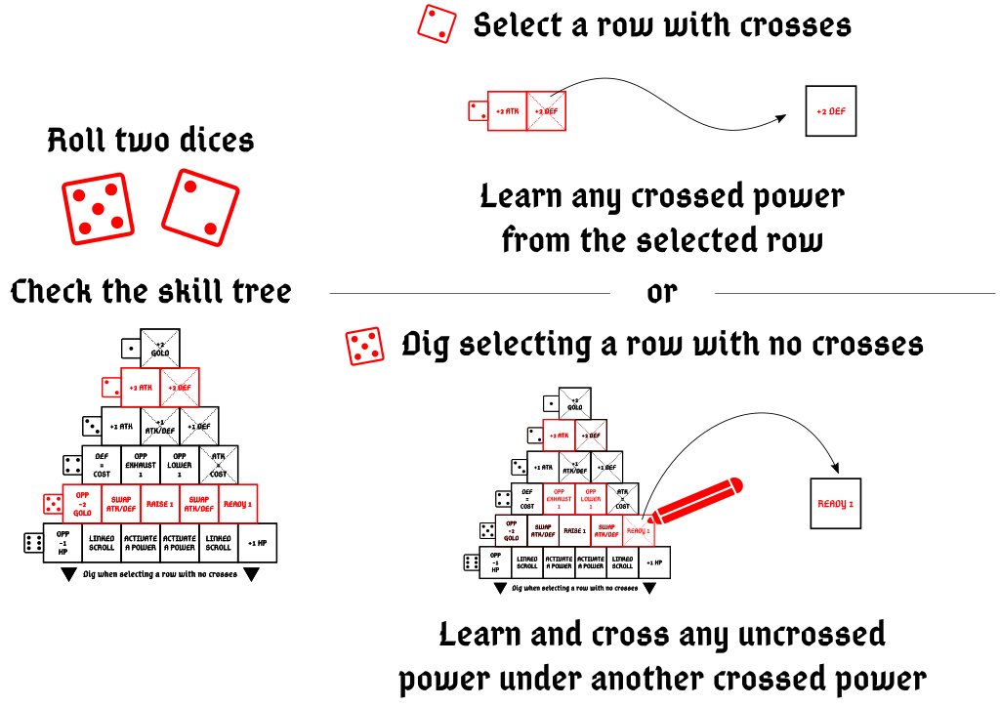

_School learning procedure: Roll two dices. Select one of the matching rows and then learn one of the crossed skills. If there are no crossed skills in that row you must learn one not crossed skill that has at least one crossed skill on its top - then cross out that skill._

### Wanderers

A mysterious collective of wandering alchemists with a rigid and merciless code of life who learns the techniques on the road. It uses so rough and uncontrollable learning methods that some argue that it shouldn't be considered a school at all. But it's the Wanderers adaptability their ace in the hole.

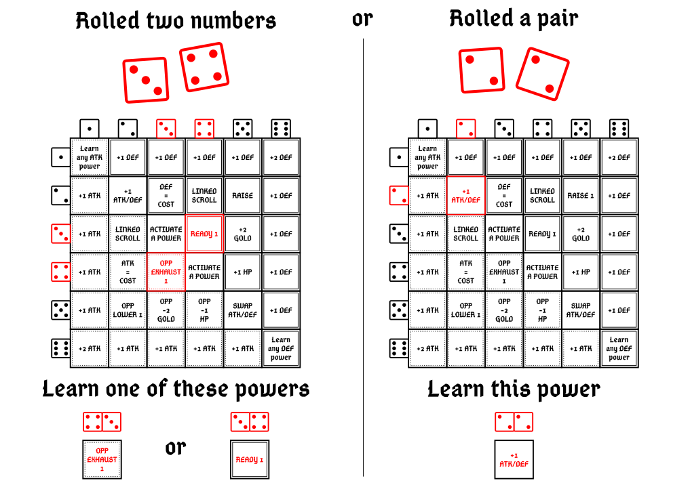

_School learning procedure: Roll two dices. You can choose between two powers matching the dice values on the grid in any order. If you roll a pair you must select the relative power on the grid diagonal._

## Dictionary

#### Activate a power
When a power is activated its effect is applied as described by the Powers section of this manual. When a power name starts with OPP or OPPONENT the effect must be applied to an opponent of the player activating it. In any other case, a power effect is applied to the player that activated it.
_When you activate a scroll all of the powers written on it are activated in order._

#### Activate a scroll
A player may activate the powers written on a scroll following its order. A scroll is usually exhausted after its activation.
_During his turn, a player can directly activate any of his ready scrolls in any order._

#### Available scroll
A scroll that doesn't have any empty space on it. Once these scrolls ready, they can be activated by the player during his turn. A player can make an unavailable scroll available by purchasing it during his turn.
_When an unavailable scroll is purchased all of its empty slots are filled, making it available._

#### Exhausted scroll
A scroll that cannot be activated directly by the player. A scroll is exhausted moving the Hand token to its center.
_At the end of its activation, a scroll is usually exhausted._

#### Learn a power
The act of selecting a power following the character school rules. Check the Schools and Learning section of this manual for more details.

#### Lower a scroll
A scroll in hand can be lowered moving its Hand token down on the next available scroll, keeping its exhausted/readied state. If the scroll is at the bottom of a column, it cannot be lowered.
_Some powers may force you or another player to lower a scroll._

#### Purchasable scroll
A purchasable scroll is any unavailable scroll in the Scrolls area that's over an available scroll. During his turn, a player can purchase any purchasable scroll on his Scrolls area paying the price printed in that scroll coin icon.
_In a player's first turn only the scrolls in the penultimate row of his Scroll area are purchasable._

#### Purchase a scroll
During his turn the player can spend gold to purchase a scroll, paying the amount displayed into its coin symbol. When a scroll is purchased all of its empty spaces are filled with a power, learning them following the player character school learning method. After a scroll is purchased, if there are no unavailable scrolls on the same row or column, a Slash power may be applied immediately.

#### Raise a scroll
A scroll in hand can be raised moving its Hand token up on the next available scroll, keeping its exhausted/ready state. If there are no available scrolls, then the Hand token is moved to the one at the bottom of the same column.
_At the end of a player's turn, all of the exhausted scrolls in his hand are usually raised and then readied._

#### Ready scroll
A scroll the player can directly activate during his turn. A scroll is readied moving the Hand token to cover its coin symbol.
_At the end of a player's turn, all of the exhausted scrolls in his hand are usually raised and then readied._

#### Select a power
The act of selecting any power from the school area, usually needed when purchasing a scroll or activating special powers. It is different from learning a power since you don't have to follow the school learning method. Selection may be restricted in some categories, like Attack or Defense powers.
_Some powers may let you select an Attack power o Defense power when purchasing a scroll._

#### Slash power
You can find Slash powers in the Scrolls area, printed in a box at the top of each scrolls column and on the right of the area's first 3 rows. After purchasing a scroll, if there are no available scrolls on its column then activate the Slash power of that column. Do the same for that scroll row: if there are no available scrolls in that scroll row, activate the Slash power of that row.
_The last row of scrolls in the Scrolls area doesn't have any Slash power._

#### Unavailable scroll
A scroll with at least one empty space on it. These scrolls can't be activated or readied. A player can make it available by purchasing it during his turn.
_When an unavailable scroll is purchased all of its empty slots are filled, making it available._

#### Undefended player
A player becomes undefended when he starts his turn with a Defense value less or equal to 0 (i.e. Defense token is not on the DEF track or it is on the track negative side) or when he broke his defense on his turn. When a player becomes undefended, he stays undefended for his whole turn.
_An undefended player can use +x DEF powers during his turn to change his defense value._

## Powers

The default target of a power is the player that's activating it. If the power name is preceded by OPP or OPPONENT, the player opponent must apply the power effect.

Normal powers are written in uppercase letters. Powers with a name written in lower case are activated immediately when learned and can't be copied on a scroll.

| Power | Description |
| --- | --- |
| **+x ATK** | The target must increase his Attack value OR available Gold value by X. |
| **+x ATK / +x DEF / ...** | The target must apply the effects of each line one by one following the order. |
| **+x ATK/DEF** | The target must increase his Attack value OR Defense value OR available Gold by X. |
| **+x DEF** | If the target is the player that activated the power he must increase his Defense value (only if he is undefended) OR available Gold value by X. If the target is an opponent, he must increase his Defense value by X. |
| **+x GOLD** | The target must increase his available Gold value by X. |
| **+x HP** | The target must increase his Health value by x. |
| **-x GOLD** | The target must decrease his available Gold value by X. |
| **-x HP** | The target must decrease his Health value by x. |
| **ACTIVATE A POWER** | The target must learn a power following his character school rules and immediately activate it. |
| **ATK = COST** | The target must set his Attack value to the scroll cost or the character maximum Attack when not possible. If the power is not activated from a scroll it has no effect. |
| **DEF = COST** | The target must set his Defense value to the scroll cost or the character maximum Defense when not possible. If the power is not activated from a scroll it has no effect. |
| **EXHAUST x** | The target must exhaust x scrolls. If there are no more scrolls that can be exhausted, its effect ends. |
| **GOLD = COST** | The target must set his Gold value to the scroll cost or the character maximum Gold when not possible. If the power is not activated from a scroll it has no effect. |
| **LINKED SCROLL** | The target must activate all of your exhausted scrolls with a LINKED SCROLL power printed on them. The LINKED SCROLL power has no effect on the scrolls activated this way. |
| **LOWER x** | The target must lower one of his higher scrolls x times. |
| **Learn any ATK power** | This power is activated immediately when learned and it can't be written on a scroll. The target must learn any other Attack power (dashed border) from his character sheet School area. Then, if the target is purchasing a scroll write the learned power in that scroll, otherwise he must apply the learned power effects immediately. |
| **Learn any DEF power** | This power is activated immediately when learned and it can't be written on a scroll. The target must learn any other Defense power (solid border) from his character sheet School area. Then, if the target is purchasing a scroll write the learned power in that scroll, otherwise he must apply the learned power effects immediately. |
| **RAISE x** | The target must raise one of his scrolls x times. |
| **READY x** | The target must ready x exhausted scrolls. If there are no more exhausted scrolls, its effect ends. |
| **SWAP ATK/DEF** | The target must swap the Attack and Defense values. |
| **SWAP GOLD/ATK** | The target must swap the Gold and Attack values. |
| **SWAP GOLD/DEF** | The target must swap the Gold and Defense values. |

## FAQ

**Q: I'm purchasing a scroll that activates a Slash power that gives me Gold. Can I spend that Gold to buy that scroll or its powers?** \
**A:** No. A Slash power activates AFTER the last unavailable scroll of a row or column is purchased, so you aren't affected by any Slash power before or during that scroll purchase process.

